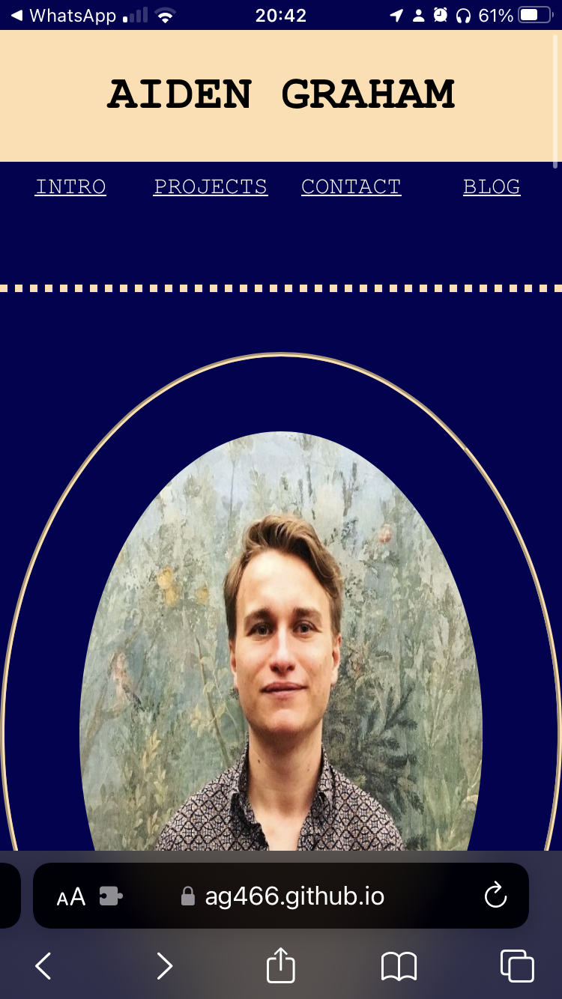
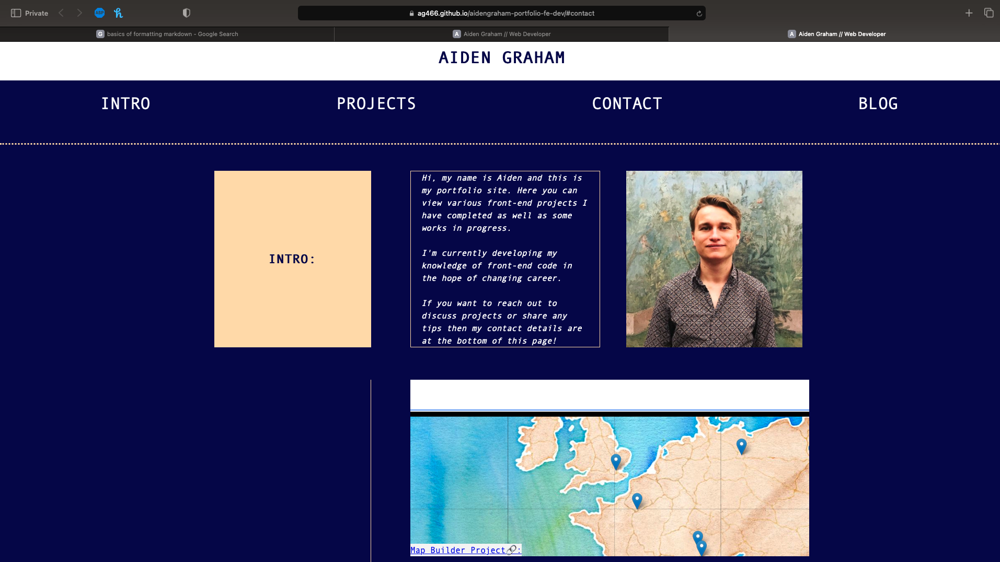

# aidengraham-portfolio-fe-dev
A portfolio showcasing skills in front end web design

## INTRODUCTION:  Project Brief
The aim of this project was to develop a portfolio site which could be added to as I hone my front-end development skills.

The project makes use of fundamental HTML and CSS principles- employing a range of style properties and layout techniques.

The acceptance criteria for this project were the following:

1. When the page is loaded the page presents your name, a recent photo or avatar, and links to sections about you, your work, and how to contact you
2. When one of the links in the navigation is clicked then the UI scrolls to the corresponding section
3. When viewing the section about your work then the section contains titled images of your applications
4. When presented with the your first application then that application's image should be larger in size than the others
5 When images of the applications are clicked then the user is taken to that deployed application
6. When the page is resized or viewed on various screens and devices then the layout is responsive and adapts to my viewport

## Acceptance Criteria 1.
My site features my name, a photo of myself and links to the sections of the document which hold information about myself, recent projects and my contact details.

My name is featured at the top of the site to clearly establish the sites purpose as a professional web-site centered around my work as a front-end developer. The image used is clear and renders well both when viewed on a mobile or a large monitor.

## Acceptance Criteria 2.
The links are located beneath the title section with my name. The links are as follows:

*intro
*projects
*contact
*blog

Note that the blod link is non-functional but is included as a statement of intent for a plan to link the web-page to a blog site I intend to write about the skills I have learnt during the bootcamp.

The remaining links will take the user to the relevant section of the web-page.

## Acceptance Criteria 3 & 5.
I have displayed to date 3 projects on my portfolio site.

1. a link to a map web program I have made which can be edited to hold pins for various geographical locations and display information and images about said locations. This site is a prototype for a project I am assisting on.

2. a link to the Horiseon page deployed from the WK1 challenge.

3. reference to a site I made for a small shop in Grasko, Sweden. This project is not linked as is not deployed. I only include it on the site to further display the underlying grid structure of the site.

When the images are hovered over- they reveal information about the project and a link to the deployed application (Where applicable). I chose to write up information about the projects within the images and to display on "hover" to conserve space within the site and give what I feel was a sleaker design. I felt this was a more ambitious approach as it showcases some of the pseudocode learnt in class during WK2.

I chose also to place a link within text which is displayed on each of the images. I felt that the use of background images provided better results in terms of image quality when the site was resized. I could not make the background images themselves clickable so opted to use text within the images. I liked this approach and decided to stick with it as it fufills the brief and means the user has to exercise more intentionality to follow a link through rather than inadvertently being rerouted to my deployed applications by an accidental click.

## Acceptance Criteria 4

The first displayed project for the map application I have made is twice as large as the images for the other two projects. This has been achieved by using the underlying grid structure to deploy the section across two grid cells, in comparison to the other images which are contained within one cell each.

## Acceptance Criteria 6

I have tested the site on both my mobile device (Apple SE 21 and on my Mac both on a larger HP display and on the Macs own display.) In all formats- the components of the site remained on screen without off screen overhang and a need to scroll. The site thus has a rather professional finish without components streching over the outer perimiters of the site.

The site responds to resizing well and changes from the expansive view with a clear grid structure to a single column format. The single column format used for displays under 900px was chosed to provide a coherent linear journey through the sites content. This was to prevent confusion and user frustration arising from content being bunched on single rows.

## Note on HTML code.
This site is quite light on HTML content with most of the styling of the site being achieved through css. The HTML is concise and is written with the user experience in mind. Therefore content which renders towards the top of the site appears in prime position within the HTML code.

## Note on CSS
The underlying site structure is achieved in all instances through the use of the CSS grid property. The grid was chosen to provide control over positioning and to confer me as the designer of the site the ability to give different projects different degrees of prominence. For example, with the grid I am able to make some projects appear larger than others to draw in a users attention. The grid will also aid me when it comes to editing the site in future. I will be able to move elements around within the grid easily by simply extending the grid-template-areas property and then fitting in the new grid components. 

Inside of the grid, I have used some flex elements to aid the site when transitions are made from large views to small views. 

The aesthetics of the site were also achieved through CSS and I am satisfied with the finished product which I believe sends a sleak and professional message to prospective employers.

## Media Query

Media queries has enabled optmisation of the site for devices > 900 px i.e. laptops / monitors as well as those <900px i.e. tablets/ mobiles.

I am satisfied with both 'versions' of the site and have spent time focusing on both in turn. 

Both optimisations have a continuous underlying theme but change the structure of content to suit the limitations imposed by screensize. 

My philosophy here has been to use the space of a large display to showcase responsive design and provide the user with an experience which allows them to easily access and jump to features of interest. Alternatively I have used the small display to provide a structured journey through all of the sections of my site. This ensures that all content is presented to a user (without risk of being missed). 

## Future Proposals
The site will be added to throughout the bootcamp and beyond. I feel that the underlying grid structure which gives shape to the site will enable me to add content with ease and this is a huge benefit for future use. 

I would like to simplify some of the CSS code on the site but with a deadline to meet I have prioritised the final product rather than the efficiency of code. My aim is to furtherr bolster the future readiness of the site by streamlining the CSS particularly so that updates are quick and effortless.

### Large Display

### Small display

Link to site: https://ag466.github.io/aidengraham-portfolio-fe-dev/#contact